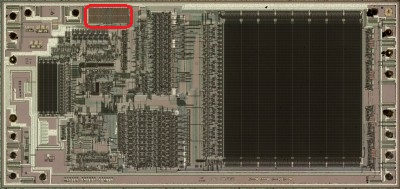
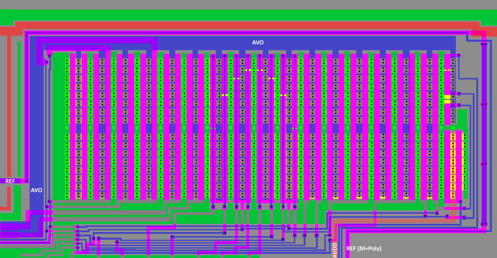
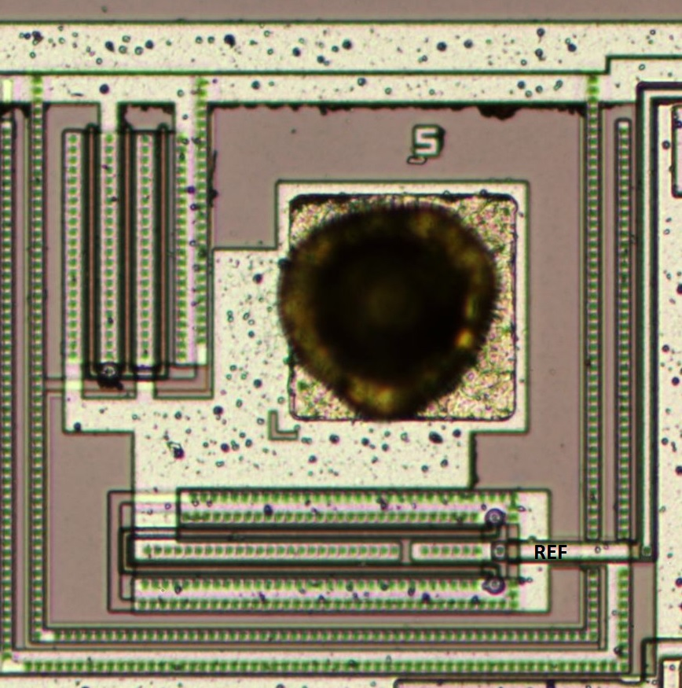
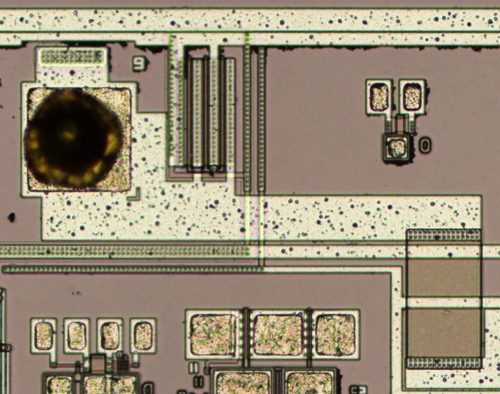

# DAC

The uPD7755/56 has an internal D/A converter, that is a 
unipolar, current-output type with 9-bit resolution. The 
output current of the D/A can be controlled by the 
voltage applied at the REF pin. 

## REF (D/A Converter Reference Current)

REF inputs the sink-load current that controls the D/A 
converter output. REF should be connected to Vdd via 
a resistor. In standby mode, REF becomes high impedance.

## AVO (Analog Voice Output)

AVO outputs synthesized speech from the D/A converter. This is a unipolar sink-load current. 

