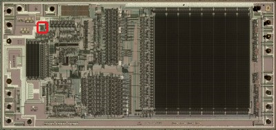
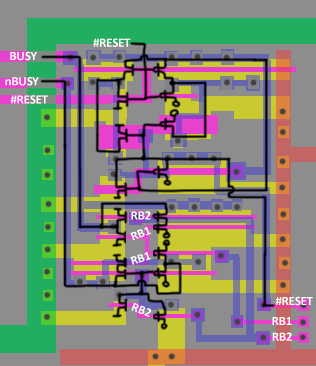

# Reset/Busy



Based on the `RB1` / `RB2` signals, a complementary `BUSY` and `nBUSY` is obtained which go to the `#BUSY` terminal.

```
module ReadyBusy(input wire nRESET_Pad, input wire RB1, input wire RB2, output wire BUSY, output wire nBUSY, output wire nRESET)
	assign BUSY = nor (RB1, RB2);
	assign nBUSY = nand (RB1, ~RB2);
	assign nRESET = nRESET_Pad;
```

The value from the `#RESET` terminal goes further inward.


