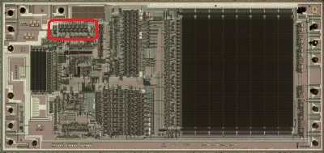
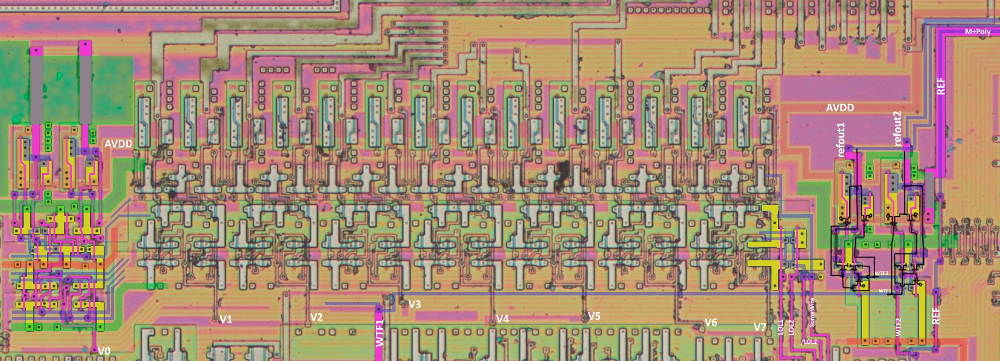

# M2

It looks like a volume register.

The order of the bits (lsb->msb) was analyzed by the wires. They come out of the big block [M8](M8.md). But this is not yet exact.

It will also be possible to clarify by DAC, who understands.

|Signal|Purpose|
|---|---|
|LOL1|Looks like some kind of CLK|
|LOL2|Looks like some kind of CLK|
|/LOL2|LOL2 is inverted and goes backwards|
|SomeWire|Reset?|
|WTF1|REF control|
|WTF2|REF control|

## Volume Register Bit

Output value for DAC in complementary(?) form.

## REF Control

On the right is a small circuit to control the Analog VDD. The REF signal goes somewhere else below, and the circuitry additionally outputs the `refout1` and `refout2` signals somewhere else.
