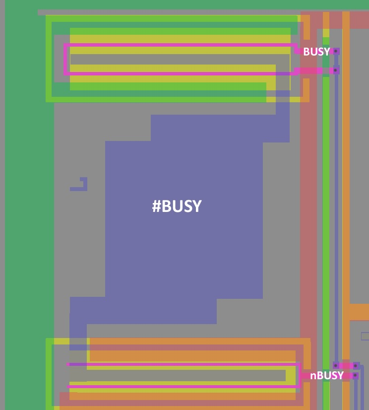
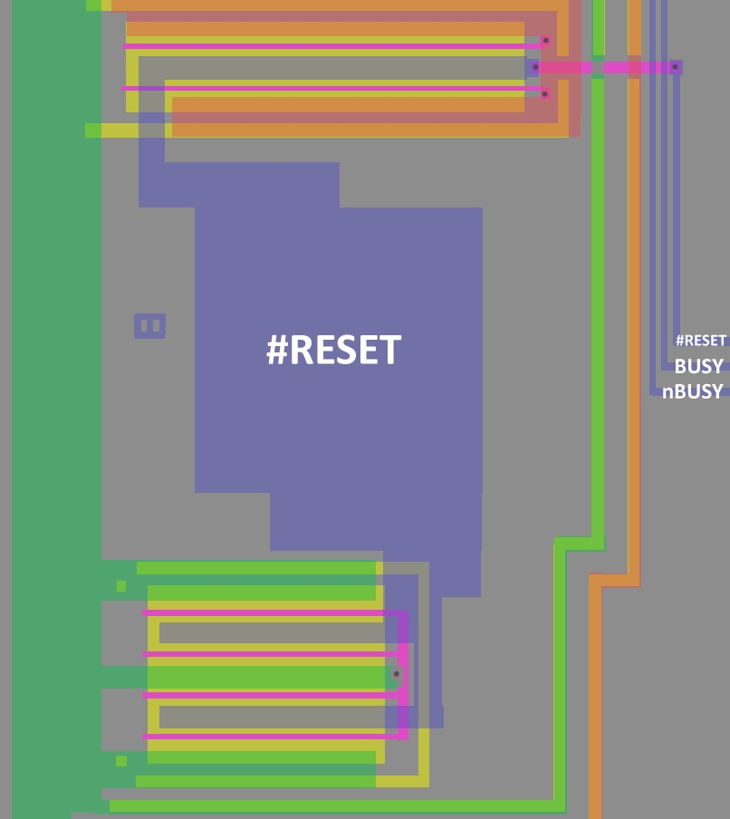

# Terminals

For audio terminals, see the [DAC](DAC.md) section.

## I0-I7 (Message Select Code)

I0-I7 input the message number of the message to be 
synthesized. The inputs are latched at the rising edge 
of the ST input. Unused pins should be grounded. In 
standby mode, these pins should be set high or low. If 
they are biased at or near typical CMOS switch input, 
they will drain excess current. 

The circuit is not like the description, because according to the schematic the terminals are `InOut`. The [IX Buffer](IXBuf.md) logic also contains output transistors AND input transistors.

## #CS (Chip Select)

When the CS input goes low, ST is enabled. 

## #ST (Start)

Setting the ST input low while CS is low will start 
speech synthesis of the message in the speech ROM 
locations addressed by the contents of I0-I7. If the 
device is in standby mode, standby mode will be 
released.

## #BUSY (Busy)

BUSY outputs the status of the PD7755/56. It goes low 
during speech decode and output operations. When 
ST is received, BUSY goes low. While BUSY is low, 
another ST will not be accepted. In standby mode, 
BUSY becomes high impedance. This is an active low 
output. 

The output pad receives 2 complementary signals `BUSY` and `nBUSY`.

## #RESET (Reset)

The RESET input initializes the chip. Use RESET 
following power-up to abort speech synthesis or to 
release standby mode. RESET must remain low at least 
12 oscillator clocks. At power-up or when recovering 
from standby mode, RESET must remain low at least 1 2 
more clocks after clock oscillation stabilizes.

## X1,X2 (Clock)

The clock pins should be connected to a ceramic 
oscillator at 640 kHz. 

Pins X1 and X2 should be connected to a 640 kHz 
ceramic oscillator. In standby mode, X1 goes low, and 
X2 goes high.

According to the circuit, everything corresponds to the description. Those two "molting pythons" are a relaxation oscillator. How it works makes no sense to go into details, since this is a scary area of electronics that starts with "anal" (better not even to google).
