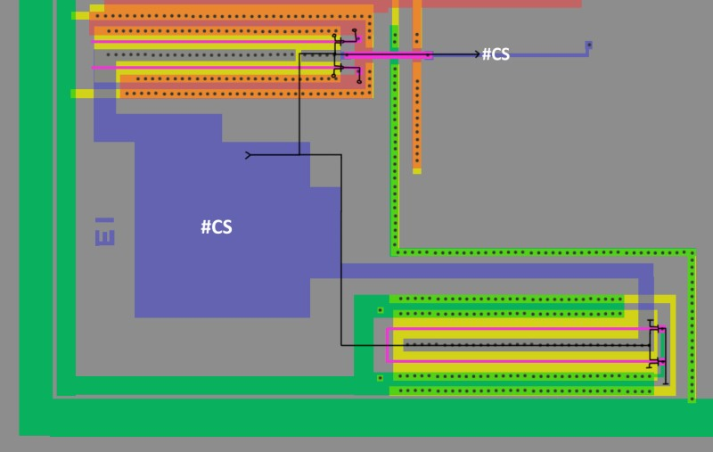

# Terminals

For audio terminals, see the DAC section.

## I0-I7 (Message Select Code)

I0-I7 input the message number of the message to be 
synthesized. The inputs are latched at the rising edge 
of the ST input. Unused pins should be grounded. In 
standby mode, these pins should be set high or low. If 
they are biased at or near typical CMOS switch input, 
they will drain excessycurrent. 

## #CS (Chip Select)

When the CS input goes low, ST is enabled. 

## #ST (Start)

Setting the ST input low while CS is low will start 
speech synthesis of the message in the speech ROM 
locations addressed by the contents of Iq-Iz- If the 
device is in standby mode, standby mode will be 
released.

## #BUSY (Busy)

BUSY outputs the status of the//PD7755/56. It goes low 
during speech decode and output ope rations . When 
ST is received, BUSY goes lovy: While BUSY is low, 
anothe r ST will not be accepted. In standby mode, 
BUSY becomes high impedance. This is an active low 
output. 

## #RESET (Reset)

The RESET input initializes the chip. Use RESET 
following power-up t o abort speech synthesis or to 
release standby mode. RESET must remain low at least 
12 oscillator clocks. At pow er-up or when recovering 
from standby mode, RESET must remain low at least 1 2 
more clocks after clock oscillation stabilizes. 

## X1,X2 (Clock)

The clock pins should be connected to a ceramic 
oscillator at 640 kHz. 

Pins X1 and X2 should be connected to a 640 kHz 
ceramic oscillator. In standby mode, X1 goes low, and 
X2 goes high.
