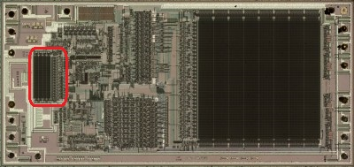
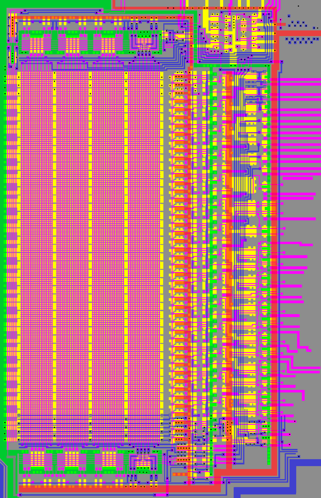
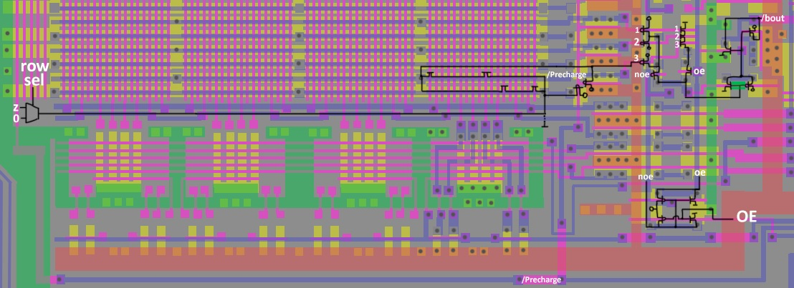

# ROM2 (Command Memory?)

Features:
- Implanted NAND + Precharge.
- Divided into two parts - upper (8 bits) and lower (7 bits)
- Each bit is connected to three rows
- Each row consists of two lanes
- Each lane consists of four 18-bit words

## Row

The schematic shows the implanted mask transistors conventionally. They are not actually known.

The row selector is designed like NAND, but the tranisistors in it are also implanted, so it is not known in what order the rows go (But it doesn't matter).

Principle of operation:
- During Precharge all rows are "recharged".
- During the value issuing - the row that is selected is connected to GND, so that the group of Word-transistors turns into 18-NAND.
- The value bit of the row goes to the collecting 3-NAND. If the word bit value is `0`, then the 3-NAND outputs a value of `1`. If the word bit value is `1`, then 3-NAND outputs a value of `0`. Those rows which do not participate return `1` due to the Precharge. This is to make 3-NAND work with a value of `1`, for the row that is participating.

## Column Decoder

TBD.

## Output Values

The upper group of values comes out in complementary form.

TBD: picture

The lower group of values comes out in regular AND complementary form. Therefore, for the upper group there are two outputs per bit, and for the lower group there are three.

TBD: picture

## The circuit in the upper right corner

TBD.
