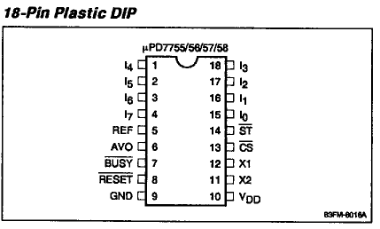
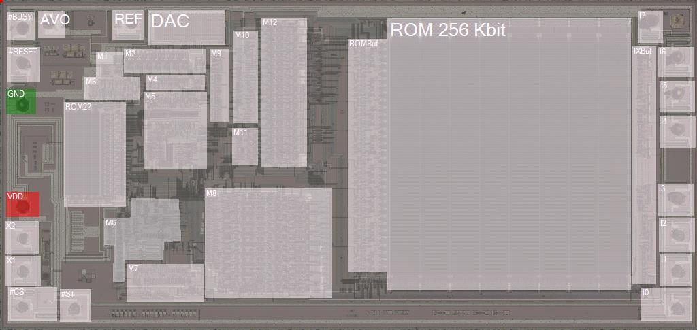

# NEC µPD775x

Fab:
- CMOS
- Single metal layer
- "Hand-made" topology (no standard cells)
- P-Pockets

Games:
- Moero!! Pro Yakyuu
- Moero!! Pro Tennis
- Moero!! Pro Yakyuu '88 Kettei Ban
- Shin Moero!! Pro Yakyuu
- Terao no Dosukoi Oozumou
- Moe Pro! '90 Kandou Hen
- Moe Pro! Saikyou Hen

Sources:
- Dataset: https://drive.google.com/drive/folders/1fqlftz1CWsBIEYqZKbxDAVdwJkAk7JM1
- Datasheet: http://archive.espec.ws/section429/file8886.html

The uPD7755 and uPD7756 are speech synthesis LSI 
devices that utilize the adaptive differential pulse 
coded modulation (ADPCM) coding method to produce 
high-quality, natural speech synthesis. By combining 
phoneme classification with the ADPCM method, the 
device achieves a compressed bit rate that can 
synthesize sound effects and melodies in addition to 
speech sound. A built-in speech data ROM allows 
synthesis of messages up to 12 seconds (uPD7755) or 
30 seconds (uPD7756) long. A wide range of operating 
voltages, a compact package, and a standby function 
permit application of the uPD7755/56 in a variety of 
speech synthesis systems, including battery-driven 
systems.

## Pinout

## Modules

## Contents

- [Terminals](Pads.md)
- [IX Buffer](IXBuf.md)
- [ROM](ROM.md)
- [ROM Buffer](ROMBuf.md)
- [DAC](DAC.md)
- [ROM2 - Microcode??](ROM2QuestionQuestionMark.md)
- [Unknown module M1 - Reset/Busy](M1.md)
- [Unknown module M2 - Volume Register?](M2.md)
- [Unknown module M3](M3.md)
- [Unknown module M4](M4.md)
- [Unknown module M5 - Main Control Unit?](M5.md)
- [Unknown module M6 - Clockgen & Stuff](M6.md)
- [Unknown module M7](M7.md)
- [Unknown module M8 - ALU?](M8.md)
- [Unknown module M9](M9.md)
- [Unknown module M10](M10.md)
- [Unknown module M11](M11.md)
- [Unknown module M12](M12.md)
