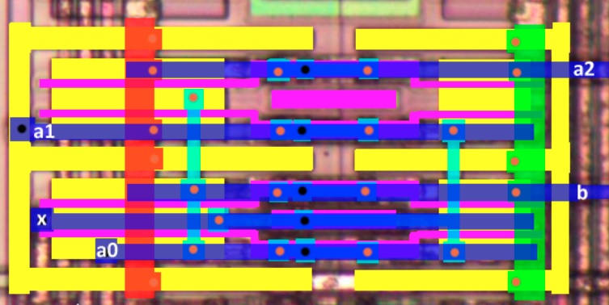
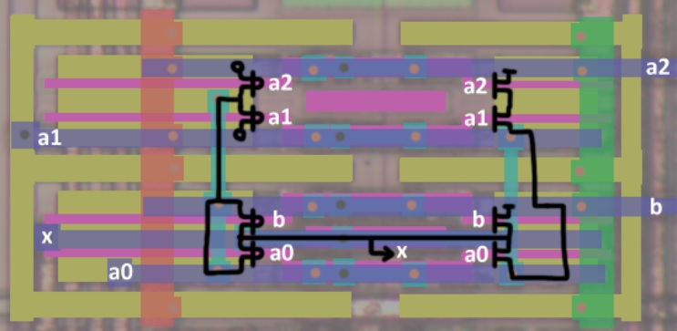

# Cells

## Logic Cell

## not

## dff

Posedge DFF.

|||
|---|---|

## comp

Complementer. Splits single rail CLK into dual rail

|||
|---|---|

## 31-aoi (Weird)

Strange 31-AOI, which has a forbidden state (a0=0, a1=a2=1, b=0), which switches the output to the HighZ state. At the same time the N-MOS part of the circuit is fully consistent with the NMOS variant of the 31-AOI.

||||
|---|---|---|

I don't know how it works.
