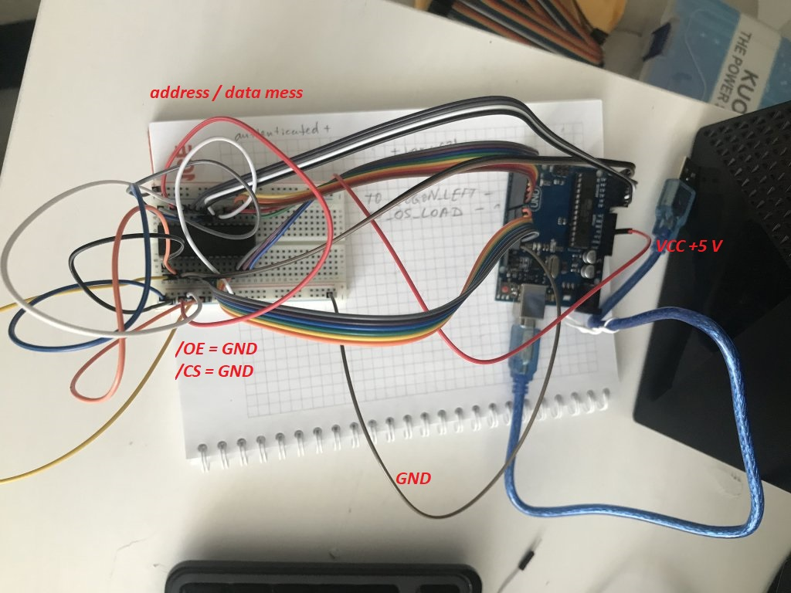
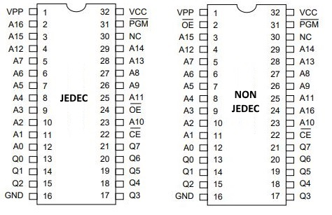
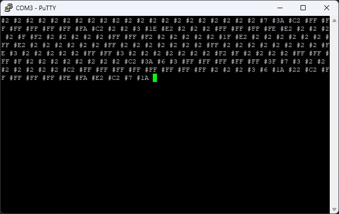

# Дампер JEDEC ромов с помощью Arduino

Если у вас совсем ничего кроме ардуино и бред борды - можно использовать такой сетап:

VPP и #PGM трогать не надо, пусть болтаются.

Нужно учитывать что иногда ромы бывают не совсем JEDEC:

https://www.jammarcade.net/1mbit-eprom-confusion-jedec-vs-non-jedec/

Также иногда pin30 (NC) бывает A17:

Скрипт прилагается, дамп сыпется по ком порту, можно использовать путти:

С форматом дампа разберётесь сами.

TODO: Интерливнутый дамп по 1 биту шины данных с последующим деинтерливом.
