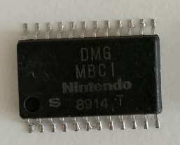

# MBC1

Exploring the zoo of MBC1 implementations. As luck would have it, the most vanilla MBC1 was the first to appear.

- Revision: MBC1 (letterless)
- Gate Array by SHARP. See: [SHARP Gate Array](/SharpGateArray/cells.md)
- 2 metal layers
- N-Pockets
- 5 rows of cells (flip symmetry)
- Total cells count: 43

Description of MBC1 can be found in the GAMEBOY Programming Manual: https://archive.org/details/GameBoyProgManVer1.1

## Netlist

## Design

Verilog restored within the Deroute utility was fed into PlanAhead and it generated the schematic itself.

## Datasets

https://drive.google.com/drive/u/2/folders/12aB6VAzrLOIOzGgljAT-jHwqS2w8JxUf

## References

- @gekkio MBC1B (NEC) research: https://github.com/Gekkio/gb-research/tree/main/mbc1b
