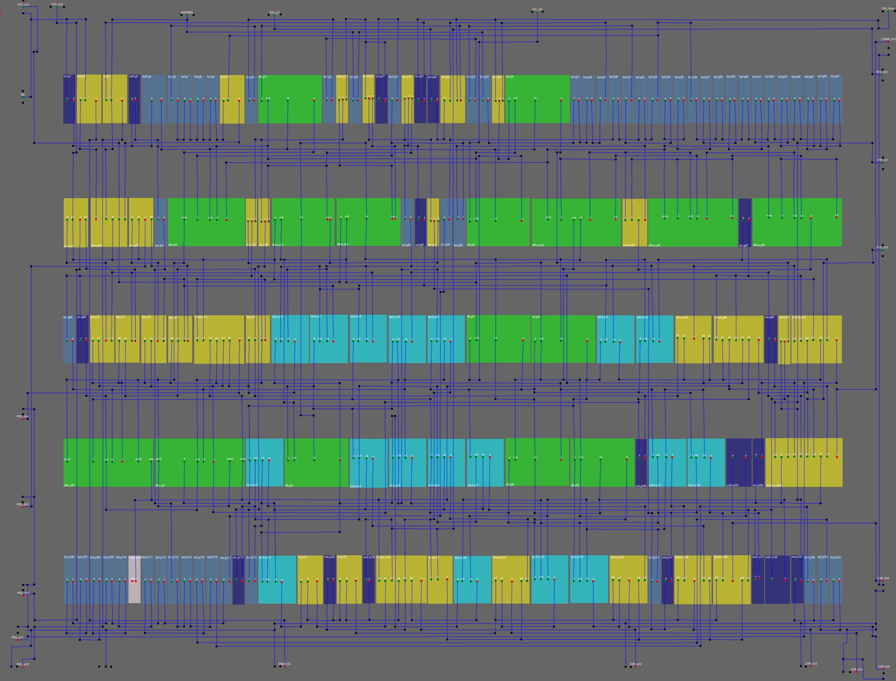

# MMC1

- Revision: MMC1 (letterless)
- Gate Array by SHARP. See: [SHARP Gate Array](/SharpGateArray/cells.md)
- 2 metal layers
- N-Pockets
- 5 rows of cells (flip symmetry)
- Total cells count: 142

## Principle of Operation

See: https://www.nesdev.org/wiki/MMC1

## MMC1 PCB Usage

The basic wiring rules for MMC1 as I understand them:
- MMC1 outputs CHR A16-A12 go to CHR A16-A12
- MMC1 outputs PRG A17-A14 go to PRG ROM A17-A14
- MMC1 output CHR A16 also goes to PRG ROM A18
- MMC1 outputs CHR A15-A14 also goes to PRG RAM address or decoder depending on the size combination

I know of three exceptions:
- In SEROM (identified by PRG ROM 32 KiB and no PRG RAM), CPU A14 bypasses the MMC1
- In SNROM (identified by PRG ROM <= 256 KiB and CHR <= 8 KiB), CHR A16 also goes to PRG RAM /CE
- In EVENT, all signals go through a multicart mapper as well

(by PinoBatch / nesdev)

## Map

## Netlist

## Back from HDL

## Logisim

## Datasets

https://drive.google.com/drive/u/0/folders/1ATtlSbatuGWMjLzN2JZpvb6VNdjwM-3F
