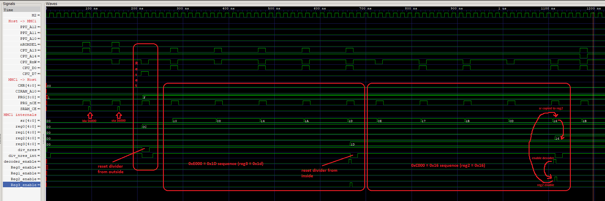

# MMC1 Test Bench

Install Icarus Verilog. Run mmc1_test. Open .vcd in GTKWave. Add signals for observation as in the picture:

Example of ignored-second-write:

## Test Vectors

See mmc1_test_vector rom. From the contents it will become clear what is going on there and how to add your experiments.

Good Luck!
