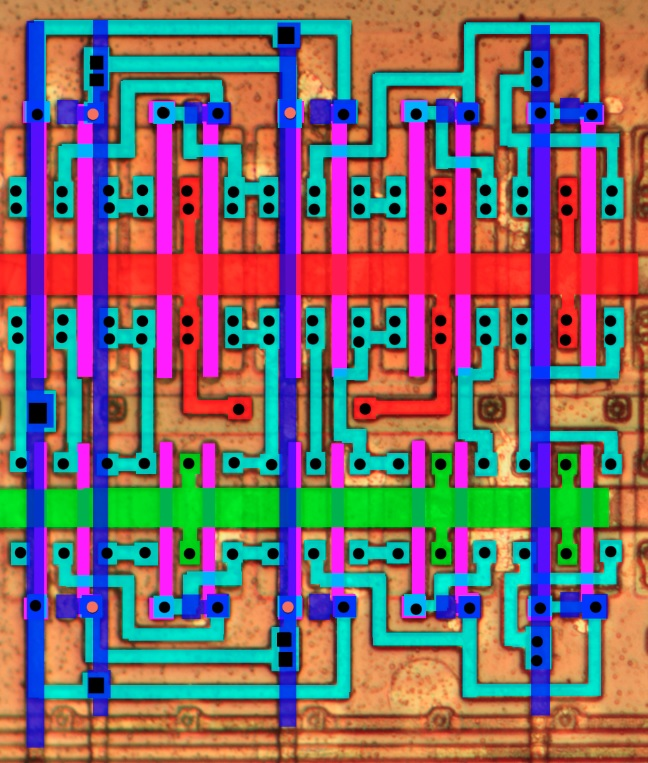

# Modules

## Logic Cell

## Not/Buf

### not

|||
|---|---|

### not2

Strong not.

### not3

Strong not.

### buf

### buf2

Strong buf. Can act as transparent DLatch (with gate memory), but nyet confirmed.

## Simple Comb

### nor

|||
|---|---|

### nand

|||
|---|---|

### or

### and

### 3-or

|||
|---|---|

## Fused Comb

### 22-aon

"two+two AND to OR NON-inverting".

|||
|---|---|

### 33-aon

"three+three AND to OR NON-inverting".

||||
|---|---|---|

### 222-aon

"two+two+two AND to OR NON-inverting".

|||
|---|---|

### 333-aon

"three+three+three AND to OR NON-inverting".

|||
|---|---|

## Sequential

### latch

Static latch. Can be used as register bit.

|||
|---|---|

### dffpos

Posedge DFF.

||||
|---|---|---|

### dffrpos

Posedge DFF with async #reset.

||||
|---|---|---|

## Misc

### const

Constant generator (`1'b0` / `1'b1`).

